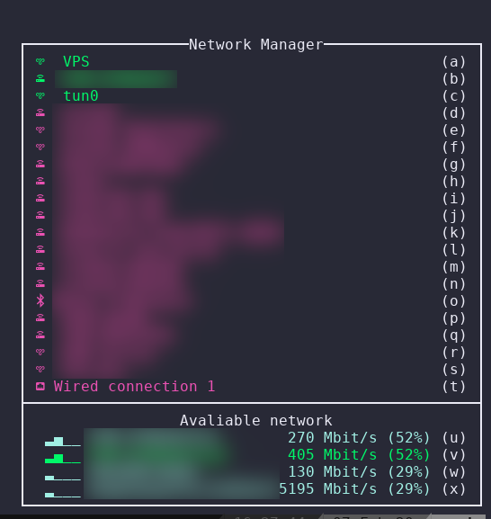

# TMUX Plugin for Network Manager

Shows a menu for handling Network Manager's profile.




## Installation
### Requirement
* Python
* Network Manager
* Tmux

### With Tmux Plugin Manager
Add the plugin in `.tmux.conf`:
```
set -g @plugin 'c3r34lk1ll3r/tmux-networkmanager.git'
```
Press `prefix + I` to fetch the plugin and source it. Done.

### Manual
Clone the repo somewhere. Add `run-shell` in the end of `.tmux.conf`:

```
run-shell PATH_TO_REPO/tmux-nm.tmux
```

Resource the file (or restart Tmux).

## Usage
Press Tmux `prefix + N` (for example, `C-b N`) and a menu will compare.

<p align="center">
  
</p>

Selecting a __connected__ network, that will be disconnected. Instead, selected a __not connected__ network, that will be connected.


## TODO
[ ] Better handling of password
[ ] A lot of testing

## License
tmux-networkmanager plugin is released under the [MIT License](https://opensource.org/licenses/MIT).
